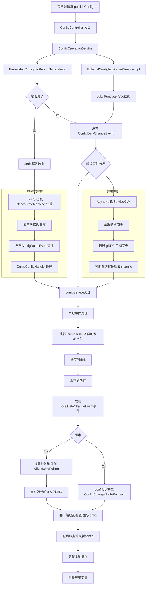

# Nacos Server Config 发布流程图

```mermaid
flowchart TD
  A[客户端请求 publishConfig] --> B[ConfigController 入口]
  B --> C[ConfigOperationService]
  C -->C1[EmbeddedConfigInfoPersistServiceImpl]
  C1 --> D{是否集群}

  D -->|是| E[Jraft 写入数据]
  D -->|否| F[发布 ConfigDataChangeEvent]
  E --> E1[Jraft 状态机NacosStateMachine 处理]
  subgraph JRAFT集群
  E1 --> E2[变更数据数据库] --> E3[发布ConfigDumpEvent事件]
  E3 --> E4[DumpConfigHandler处理]
  end
  E4 --> G1
  
  C --> C2[ExternalConfigInfoPersistServiceImpl]
  C2 --> JdbcTemplate[JdbcTemplate 写入数据] --> F[发布 ConfigDataChangeEvent]


  F --> G{异步事件分发}
  G --> G1[dumpService处理] --> H[本地事件处理]
  G --> G2[AsyncNotifyService处理]
  H --> H2[执行 DumpTask: 备份到本地文件]
  

  subgraph 集群同步
    G2[AsyncNotifyService处理] --> I[集群节点同步]
    I --> I1[通过 gRPC 广播变更]
    I1 --> I2[其他查询数据库最新config]
  end
  I2 --> G1

  H2 --> H3[缓存到disk]
  H3 --> H4[缓存到内存]
  H4 --> H5[发布LocalDataChangeEvent事件]
  H5 --> J{版本}
  J -->|1.x| K[唤醒长轮询队列: ClientLongPolling]
  K --> K1[客户端长轮询立即响应] --> M
  J -->|2.x| L[rpc通知客户端 ConfigChangeNotifyRequest]
  L --> M[客户端收到有变动的config]
  M --> M1[查询服务端最新config] --> M2[更新本地缓存] --> M3[刷新环境变量]

```
